# BurauenBiblio 📚🌴

## Project Credit & Intent

**BurauenBiblio** is a derivative work of the original **OpenBiblio** system, tailored for modern **PHP8.0** environments and localized school library needs in the **Philippines**.
Maintained as a community-driven, open-source initiative to revitalize and extend OpenBiblio's functionality designed to aid small libraries and schools.
It is named in honor of my hometown in Leyte, **Burauen**.

- OpenBiblio Authors:  
  **David Stevens, Joe Hagerty, Micah Stetson, Fred LaPlante**  
  (See LICENSE and copyright.html for full attribution)

- BurauenBiblio Maintainer: Ferdinand Tumulak 

📌 See [CHANGELOG.md](./CHANGELOG.md) for version history.

This repository includes a small set of sample bibliographic records (books) and fictional member accounts as part of the included SQL data.
These are provided solely for the purpose of demonstrating and testing the functionality of the OpenBiblio system.

The book entries are either fictional or based on public domain sources, and any associated thumbnail images are used under public domain or fair use for educational/demo purposes.

The member records are entirely fictitious and do not represent real individuals.

## ✅ PHP 8.0 Migration Notes

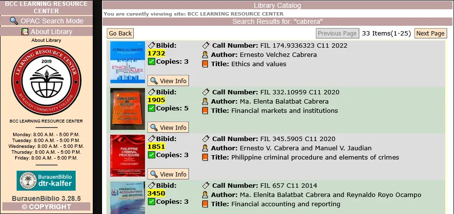

The **BurauenBiblio System** is in active use at **Burauen Community College**, supporting bibliographic search requests from both students and faculty. It currently manages nearly **5,000 bibliographic records**, with continuous growth in its collection.

For details: 

- https://librarytechnology.org/library/211849
- https://librarytechnology.org/libraries/search.pl?Country=Philippines&Type=Academic

Designed to streamline library operations, BurauenBiblio provides tools for **cataloging**, **circulation management**, **Online Public Access Catalog (OPAC)**,  and other **staff-operated features** that enhance **workplace automation**.

Upgraded to run on **PHP 8.0**, the system delivers substantial performance gains—up to **2× to 4× faster than PHP 5.7**—while maintaining **full compatibility** with the college’s existing **legacy hardware**.

If you wish to try BurauenBiblio on your existing Openbiblio database:

([shortcut 🧹 Utility - Database Migration Manager](#-utility---database-migration-manager))

## 📚 Updated Login & Welcome Interface

The login and welcome page UI has been refreshed with a cleaner, modern layout inspired by contemporary web interfaces.

This update improves visual clarity, accessibility, and mobile responsiveness while maintaining full compatibility with the existing BurauenBiblio authentication and legacy theme structure. No changes were made to core login logic.

## 📚 OPAC eBook Search and Download (Gutendex Integration)

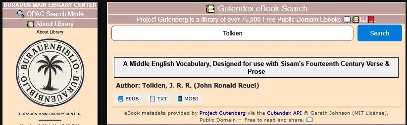

BurauenBiblio now includes a lightweight eBook search module powered by the
[Gutendex API](https://gutendex.com/)

Gutendex is a simple, self-hosted web API for serving book catalog information from [Project Gutenberg](https://www.gutenberg.org/), an online library of free ebooks.
MIT License Copyright (c) 2017 by Gareth Johnson
https://github.com/garethbjohnson/gutendex

### ✨ Features
- Search over 75,000 public domain ebook titles directly within BurauenBiblio
- View book details and available formats (EPUB, TXT, MOBI).
- 100% free and open-source, ideal for educational and library use.
- eBook search appended on OPAC module.

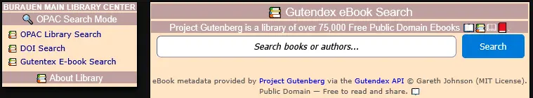

### ⚖️ License & Attribution
This feature accesses metadata and eBook files hosted by **Project Gutenberg**.
All eBooks are in the public domain within the United States and most other parts of the world at no cost and no restrictions whatsoever.

BurauenBiblio does **not store or mirror** any eBooks; all search results point to the
official Project Gutenberg servers.

## 📌 Other Features

### 📌 Calendar Manager

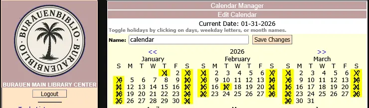

The system uses **Calendar Logic** to accurately calculate due dates based on your **library’s open and closed days**.

### 📌 Set limit on overdue charges

Member types can be configured with **overdue charge** settings. When a patron exceeds the overdue limit accumulated from the penalty/day, they are **restricted** from making additional borrowings.

### 📌 Collection Setup (borrowing policy)

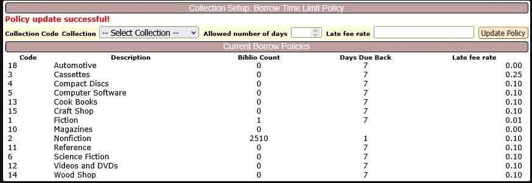

The **Collection Setup** page manages **penalty rates** and **borrowing duration** per collection.

This update refactors the previous policy system into a simpler, per-day overdue model, improving clarity, maintainability, and consistency when adjusting borrowing rules.

### 📌 OPAC DOI Search

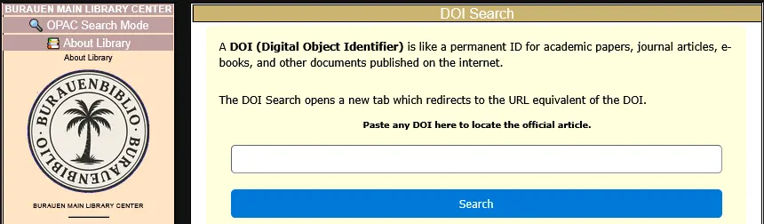

**DOI search** allows DOI to URL resolve, and patrons get redirected to the **official, authoritative source of the article (publisher, repository, or open-access platform)** on the internet.

| **Benefit**             | **Without DOI Search**           | **With DOI Search** ✅            |
| ---------------------- | -------------------------------- | -------------------------------- |
| **Find articles quickly** | Searching long titles on Google | Paste DOI → Direct link          |
| **Credible sources**     | Mixed results, blogs, PDFs      | Always official publisher       |
| **Saves time**          | Many clicks, trial and error    | One search → one result        |
| **Better research**     | Risk of outdated/unverified info | Direct access to scholarly sources |

### 📌 To-Do List 

The **To-Do List** is a simple yet powerful enhancement to the BurauenBiblio library system. It allows staff members to easily **jot down, organize, and share important notes, reminders, and tasks** directly within the library interface. Whether it’s for planning upcoming events, tracking routine duties, reminding colleagues about library schedules, or noting down quick ideas — the to-do list keeps everyone in sync.

### 📌 Card Catalog

**BurauenBiblio** prints card catalogs in a **custom 8 × 5 inch layout PDF format**, applicable for longer titles, barcodes and subject terms. It uses long bond paper (8.5 × 13 inches) which allows for two card catalog prints for each page and supports up to 35 barcode (copies). This feature helps support local libraries in need of card catalog prints.

### 📌 MARC tags setup

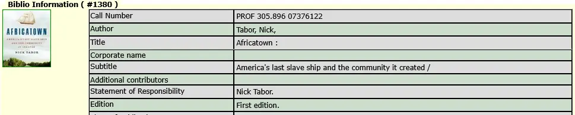

The included SQL file provides MARC tag entries tailored for **Philippine-compatible** library records.

You may also customize or extend the entries to align with your own country’s library cataloging standards or institutional requirements via **Biblio Fields** setup.

### 📌 Z39.50 Online Metadata Retrieval

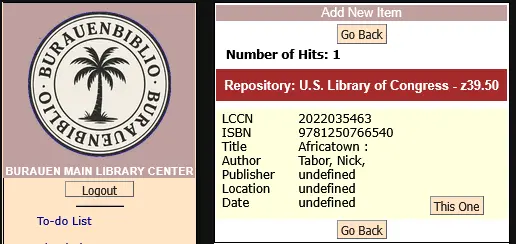

Support for metadata retrieval process—particularly for cataloging by ISBN/LCCN using remote bibliographic sources.

## 📝 Analytics

### 📝 Analytics - Monthly Circulation Report 

The **Monthly Circulation Report** is a dynamic analytics feature in BurauenBiblio that visualizes the **total number of items borrowed per month**, across a selected range of time. It helps library staff and administrators: 📅 **Track Borrowing Trends** 📚 **Evaluate Usage Patterns** 🎯 **Support Decision-Making** based on actual demand.

### 📝 Analytics - Top 30 Dewey Decimal Stats

The **Top 30 DDC Stats** feature provides an analysis of the library’s collection by visualizing the **number of copies per Dewey Decimal Classification (DDC) category**. A utility is included which allows creation of DDC table needed to make a graph (Number of Copies VS. DDC code).  The DDC utility requires a certain amount of catalogued books using DDC to get a meaningful chart.

Added 'Export to JSON' feature viewing data into JSON format for other value adding services i.e. e-bulletin.

### 📝 Advanced Dewey Decimal Classification Mapping

This process enriches bibliographic records by interpreting **Dewey Decimal Classification (DDC) numbers** into **human-readable subject categories**.

Using a **reference dataset**, we translate **raw numerical codes** into three levels of categorization: **Main Class, Division Class and Topic Class**.

Both **DDC Stats** and **DDC table listing** helps:
- Identify which classes/discipline dominate the collection.
- Spot underrepresented categories where more resources may be needed.
- Make data-informed decision for future acquisitions, inventory reviews and budget planning.
- Demonstrate the diversity of holdings to stakeholders, management, or partner institutions.
- Saves time compared to manual catalog analysis.

> DDC category descriptions are adapted from [Wikipedia](https://en.wikipedia.org/wiki/List_of_Dewey_Decimal_classes) under the [CC BY-SA 4.0 License](https://creativecommons.org/licenses/by-sa/4.0/)

### 📝 Analytics - Top 30 Borrowed Books and Top 30 Most-viewed books

The **Top 30 Borrowed Books list** showcases the titles most frequently borrowed over the past six months. The data is taken from the circulation report.

The **Top 30 Most-Viewed Books** tracks books that are regularly read or referenced by patrons within the library but not officially borrowed. This in-house usage is measured over a one-month activity span.

Before reshelving, staff can use the dedicated **In-House Book Activity Tracker** form:

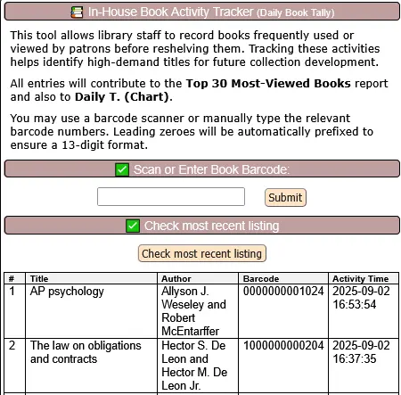

By scanning each book’s barcode—either using a barcode scanner or manual input—the system **automatically records book activity** and provides an option to **view the most recently scanned items**. This feature helps reduce reliance on paper-based tallies and ensures more accurate records. In addition, daily book tallies are **visualized through an interactive graph** with an integrated **JSON export** option for reporting and data analysis.

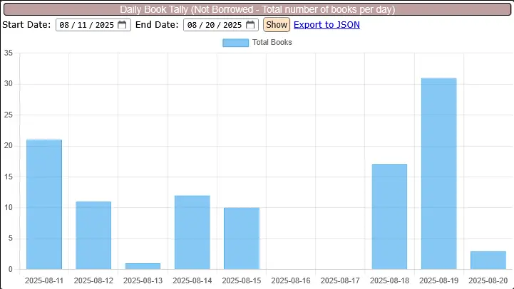

These analytics provide valuable insights into **reading trends**, **student preferences**, and **subject demand**. They support **data-driven collection development** while helping libraries move toward a **paperless, more efficient workflow**.

### 📝 Analytics - Library Attendance Tracking

A logging system designed for statistical reporting and community interaction insights. The feature allows encoding of monthly visits categorized by user type (Student, Faculty, Visitor) and, when applicable, by academic program. Using dynamic visualizations powered by Chart.js, library staff can instantly view attendance trends across custom date ranges.

Added 'Export attendance to JSON' format with 'student' only filter. You can use the info for other JSON supported services i.e. e-bulletin.

## 🧹 Utility

### 🧹 Utility - Thumbnail Check

Thumbnail check is a utility feature that finds missing thumbnail and broken image URL that is linked into the biblio records.

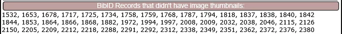

It includes biblio records without thumbnails, which happens when add thumbnail form is cancelled.

### 🧹 Utility - Orphaned BibID Cleanup Tool

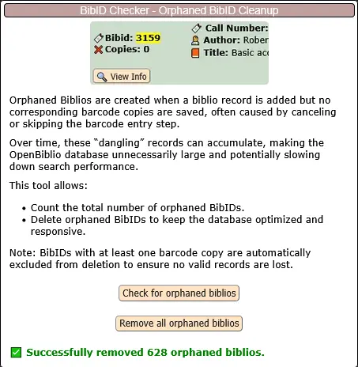

This tool helps maintain a **clean and optimized** OpenBiblio database by identifying and removing **orphaned biblios** — records that have no associated barcode copies.

### 🧹 Utility - Database Migration Manager

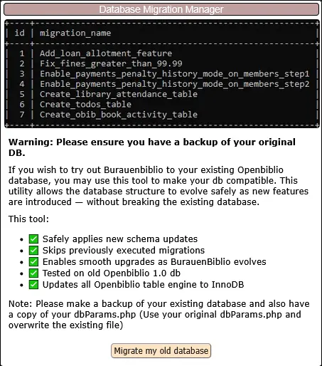

If you wish to try out Burauenbiblio to your existing Openbiblio database, you may use this tool to make your db compatible. This utility allows the database structure to evolve safely as new features are introduced — without breaking the existing database. 

> Note: Please make a backup of your existing database and also have a copy of your dbParams.php (Use your original dbParams.php and overwrite the existing file)

This tool: 
- Safely applies new schema updates
- Skips previously executed migrations
- Enables smooth upgrades as BurauenBiblio evolves
- Tested on old Openbiblio 1.0 db
- Updates all Openbiblio table engine to InnoDB

> Note: Please understand that there are several OpenBiblio-based databases out there, each with slightly different schemas. Please test the migrated database carefully on test setup before applying them to production.

## 🙌 Project Direction

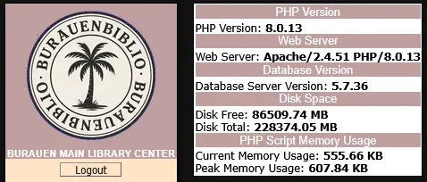

This project is part of my ongoing personal initiative to modernize the OpenBiblio codebase.

The development focuses on:

- Fixing critical bugs

- Enhancing the user interface

- Introducing new features to improve usability and performance

Recent updates also incorporate **HTMX** and other modern frontend tools, delivering a more dynamic and responsive user experience—without the overhead of a full JavaScript framework. This approach keeps the system lightweight, accessible, and well-suited for **small libraries and schools** while aligning with current **web standards**.

On the backend, parts of the **legacy procedural PHP code** have been refactored into a more **object-oriented (class-based)** structure, improving maintainability, reusability, and overall code clarity.

This modernization effort builds on the original **OpenBiblio system**, tailored to the needs of libraries in the **Philippines**, with a strong focus on **performance, compatibility, and ease of use**.

If you find this project valuable, you can support its development so it can continue to grow and serve libraries effectively.

## 📦 Installation

📌 See [how_to_install.md](./how_to_install.md) for installation.
