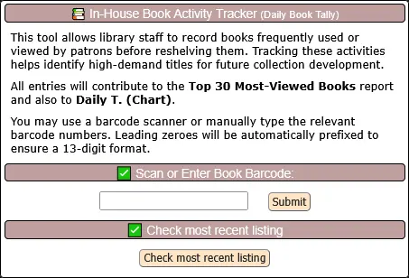
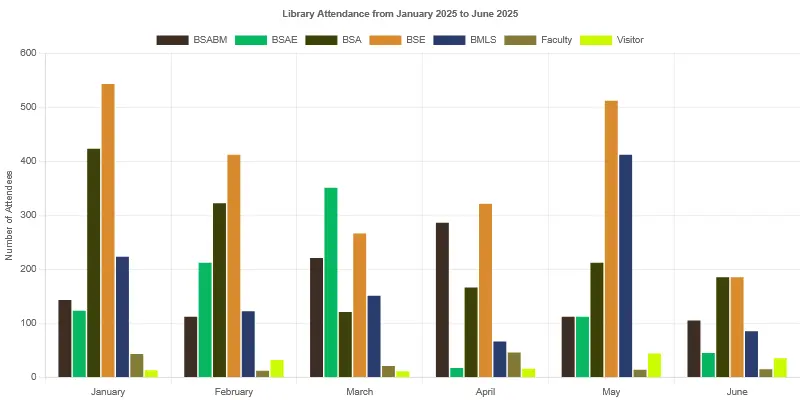
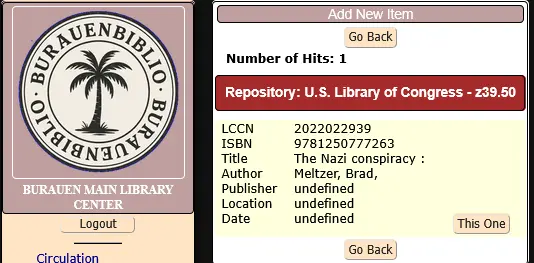

# BurauenBiblio 📚🌴

## Project Credit & Intent

**BurauenBiblio** is a derivative work of the original **OpenBiblio** system, tailored for modern **PHP8.0** environments and localized school library needs in the **Philippines**.
Maintained as a community-driven, open-source initiative to revitalize and extend OpenBiblio's functionality designed to aid small libraries and schools.
It is named in honor of my hometown in Leyte, **Burauen**.

- OpenBiblio Authors:  
  **David Stevens, Joe Hagerty, Micah Stetson, Fred LaPlante**  
  (See LICENSE and copyright.html for full attribution)

- BurauenBiblio Maintainer: Ferdinand Tumulak 

📌 See [CHANGELOG.md](./CHANGELOG.md) for version history.

This repository includes a small set of sample bibliographic records (books) and fictional member accounts as part of the included SQL data.
These are provided solely for the purpose of demonstrating and testing the functionality of the OpenBiblio system.

The book entries are either fictional or based on public domain sources, and any associated thumbnail images are used under public domain or fair use for educational/demo purposes.

The member records are entirely fictitious and do not represent real individuals.

## ✅ PHP 8.0 Migration Notes

The **BurauenBiblio system** is actively used at **Burauen Community College**, serving bibliographic search requests from both students and faculty. It currently manages a collection of nearly **5,000 bibliographic records**. The system now runs on **PHP 8.0**, offering substantial performance improvements over PHP 5.7—with speeds up to **2x to 4x faster**, depending on the workload, while continuing to operate on the same **legacy hardware**. 

For details: https://librarytechnology.org/library/211849

### 📌 Calendar Manager

The system uses **Calendar Logic** to accurately calculate due dates based on your **library’s open and closed days**.

### 📝 To-Do List 

The **To-Do List** is a simple yet powerful enhancement to the BurauenBiblio library system. It allows staff members to easily **jot down, organize, and share important notes, reminders, and tasks** directly within the library interface. Whether it’s for planning upcoming events, tracking routine duties, reminding colleagues about library schedules, or noting down quick ideas — the to-do list keeps everyone in sync.

### 📝 Analytics - Monthly Circulation Report 

The **Monthly Circulation Report** is a dynamic analytics feature in BurauenBiblio that visualizes the **total number of items borrowed per month**, across a selected range of time. It helps library staff and administrators: 📅 **Track Borrowing Trends** 📚 **Evaluate Usage Patterns** 🎯 **Support Decision-Making** based on actual demand.

Added 'Export to JSON' feature for extending circulation data into JSON format for other value adding services i.e. e-bulletin.

### 📝 Analytics - In-House Book Activity Tracker (Daily Book Tally)

This data gathering feature allows library staff to log and monitor book usage inside the library — even without official check-outs. It identifies high-interest materials for future collection development. The collected data is processed into **Top 30 Most Viewed Books within Library**.

### 📝 Analytics - Top 30 Borrowed Books and Top 30 Most-viewed books

The **Top 30 Borrowed Books** feature highlights the most frequently borrowed titles over the past six months, while the **Top 30 Borrowed Books** are books that are constantly viewed by patrons but not officially borrowed in a span of one month.  Both feature offers valuable insights into **reading trends, student preferences, and subject demand**. Both feature identifies high-interest books required for future collection development.

### 📝 Analytics - Library Attendance Tracking

A simple yet powerful attendance logging system designed for statistical reporting and community interaction insights. The feature allows encoding of monthly visits categorized by user type (Student, Faculty, Visitor) and, when applicable, by academic program. Using dynamic visualizations powered by Chart.js, library staff can instantly view attendance trends across custom date ranges.

Added 'Export attendance to JSON' format with 'student' only filter. You can use the info for other JSON supported services i.e. e-bulletin.

### 📝 Utility - Thumbnail Check

Thumbnail check is a utility feature that finds missing thumbnail and broken image URL that is linked into the biblio records.

### 📌 Set limit on overdue charges

Member types can be configured with **overdue charge** settings. When a patron exceeds the overdue limit accumulated from the penalty/day, they are **restricted** from making additional borrowings.

### 📌 Card Catalog

**BurauenBiblio** prints card catalogs in a **custom 8 × 5 inch layout PDF format**, applicable for longer titles, barcodes and subject terms. It uses long bond paper (8.5 × 13 inches) which allows for two card catalog prints for each page. This feature helps support local libraries in need of card catalog prints.

### 📌 MARC tags setup

The included SQL file provides MARC tag entries tailored for **Philippine-compatible** library records.

You may also customize or extend the entries to align with your own country’s library cataloging standards or institutional requirements via **Biblio Fields** setup.

### 📌 Z39.50 Online Metadata Retrieval

Support for metadata retrieval process—particularly for cataloging by ISBN/LCCN using remote bibliographic sources.

### 🙌 Project Direction

This upgrade is part of my ongoing personal initiative to modernize the **OpenBiblio** codebase. The development focuses on addressing critical bugs, enhancing the user interface, and introducing new features aimed at improving usability and performance. The project now includes full support for **PHP 8.0**, with preparations underway for compatibility with **PHP 8.1** and beyond.

In addition, newer improvements are being built using **HTMX** and other modern frontend technologies, allowing for a more dynamic and responsive user experience without the complexity of a full JavaScript framework. This effort reflects a commitment to bringing OpenBiblio closer to current web standards while preserving its simplicity and accessibility for small libraries and schools.

This project is an ongoing modernization effort based on the original **OpenBiblio** system. It aims to improve performance, ensure compatibility with modern PHP versions, and enhance the overall user experience.

Contributions and testing feedback are genuinely welcome and appreciated—as they help sustain and grow this project further.

## 📦 Installation

📌 See [how_to_install.md](./how_to_install.md) for installation.
