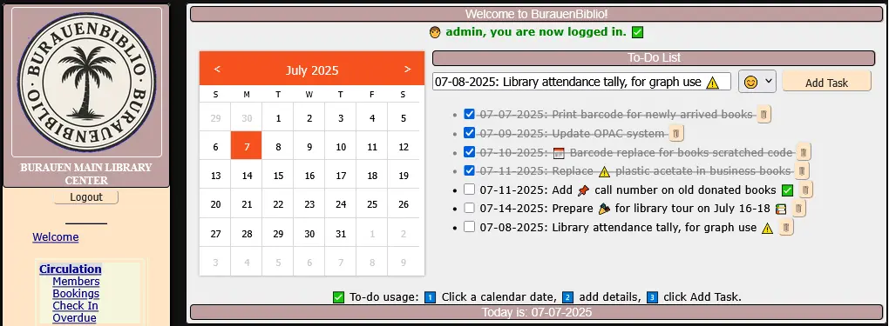

# BurauenBiblio 📚🌴

## Project Credit & Intent

**BurauenBiblio** is a derivative work of the original **OpenBiblio** system, tailored for modern **PHP8.0** environments and localized school library needs in the **Philippines**.
Maintained as a community-driven, open-source initiative to revitalize and extend OpenBiblio's functionality designed to aid small libraries and schools.
It is named in honor of my hometown in Leyte, **Burauen**.

- OpenBiblio Authors:  
  **David Stevens, Joe Hagerty, Micah Stetson, Fred LaPlante**  
  (See LICENSE and copyright.html for full attribution)

- BurauenBiblio Maintainer: Ferdinand Tumulak 

📌 See [CHANGELOG.md](./CHANGELOG.md) for version history.

This repository includes a small set of sample bibliographic records (books) and fictional member accounts as part of the included SQL data.
These are provided solely for the purpose of demonstrating and testing the functionality of the OpenBiblio system.

The book entries are either fictional or based on public domain sources, and any associated thumbnail images are used under public domain or fair use for educational/demo purposes.

The member records are entirely fictitious and do not represent real individuals.

## ✅ PHP 8.0 Migration Notes

The **BurauenBiblio System** is in active use at **Burauen Community College**, supporting bibliographic search requests from both students and faculty. It currently manages nearly **5,000 bibliographic records**, with continuous growth in its collection.

Designed to streamline library operations, BurauenBiblio provides tools for **cataloging**, **circulation management**, **OPAC (Online Public Access Catalog)**,  and other **staff-operated features** that enhance **workplace automation**.

Upgraded to run on **PHP 8.0**, the system delivers substantial performance gains—up to **2× to 4× faster than PHP 5.7**—while maintaining **full compatibility** with the college’s existing **legacy hardware**.

For details: https://librarytechnology.org/library/211849

### 📌 Calendar Manager

The system uses **Calendar Logic** to accurately calculate due dates based on your **library’s open and closed days**.

### 📝 OPAC DOI Search

DOI search allows DOI to URL resolve, and patrons get redirected to the official, authoritative source of the article (publisher, repository, or open-access platform) on the internet.

| **Benefit**             | **Without DOI Search**           | **With DOI Search** ✅            |
| ---------------------- | -------------------------------- | -------------------------------- |
| **Find articles quickly** | Searching long titles on Google | Paste DOI → Direct link          |
| **Credible sources**     | Mixed results, blogs, PDFs      | Always official publisher       |
| **Saves time**          | Many clicks, trial and error    | One search → one result        |
| **Better research**     | Risk of outdated/unverified info | Direct access to scholarly sources |

### 📝 To-Do List 

The **To-Do List** is a simple yet powerful enhancement to the BurauenBiblio library system. It allows staff members to easily **jot down, organize, and share important notes, reminders, and tasks** directly within the library interface. Whether it’s for planning upcoming events, tracking routine duties, reminding colleagues about library schedules, or noting down quick ideas — the to-do list keeps everyone in sync.

### 📝 Analytics - Monthly Circulation Report 

The **Monthly Circulation Report** is a dynamic analytics feature in BurauenBiblio that visualizes the **total number of items borrowed per month**, across a selected range of time. It helps library staff and administrators: 📅 **Track Borrowing Trends** 📚 **Evaluate Usage Patterns** 🎯 **Support Decision-Making** based on actual demand.

### 📝 Analytics - Top 30 Dewey Decimal Stats

The **Top 30 DDC Stats** feature provides an analysis of the library’s collection by visualizing the **number of copies per Dewey Decimal Classification (DDC) category**. A utility is included which allows creation of DDC table needed to make a graph (Number of Copies VS. DDC code).  The DDC utility requires a certain amount of catalogued books using DDC to get a meaningful chart.

### 📝 Analytics - Advanced Dewey Decimal Classification Mapping

This process enriches bibliographic records by interpreting **Dewey Decimal Classification (DDC)** numbers into **human-readable subject categories**.

Using a reference dataset, we translate raw numerical codes into three levels of categorization: Main Class, Division Class and Topic Class.

The graph and table listing helps:
- Identify which classes/discipline dominate the collection.
- Spot underrepresented categories where more resources may be needed.
- Make data-informed decision for future acquisitions, inventory reviews and budget planning.
- Demonstrate the diversity of holdings to stakeholders, management, or partner institutions.
- Saves time compared to manual catalog analysis.

Added 'Export to JSON' feature viewing data into JSON format for other value adding services i.e. e-bulletin.

> DDC category descriptions are adapted from [Wikipedia](https://en.wikipedia.org/wiki/List_of_Dewey_Decimal_classes) under the [CC BY-SA 4.0 License](https://creativecommons.org/licenses/by-sa/4.0/)

### 📝 Analytics - Top 30 Borrowed Books and Top 30 Most-viewed books

The **Top 30 Borrowed Books list** showcases the titles most frequently borrowed over the past six months.

The **Top 30 Most-Viewed Books** tracks books that are regularly read or referenced by patrons within the library but not officially borrowed. This in-house usage is measured over a one-month activity span.

Before reshelving, staff can use the dedicated **In-House Book Activity Tracker** form:

By scanning each book’s barcode—either with a scanner or manual entry—the system **automatically logs usage data** without the need for paper-based tallies. The tallied books per day also has its own graph with JSON export feature.

These analytics provide valuable insights into **reading trends**, **student preferences**, and **subject demand**. They support **data-driven collection development** while helping libraries move toward a **paperless, more efficient workflow**.

### 📝 Analytics - Library Attendance Tracking

A simple yet powerful attendance logging system designed for statistical reporting and community interaction insights. The feature allows encoding of monthly visits categorized by user type (Student, Faculty, Visitor) and, when applicable, by academic program. Using dynamic visualizations powered by Chart.js, library staff can instantly view attendance trends across custom date ranges.

Added 'Export attendance to JSON' format with 'student' only filter. You can use the info for other JSON supported services i.e. e-bulletin.

### 📝 Utility - Thumbnail Check

Thumbnail check is a utility feature that finds missing thumbnail and broken image URL that is linked into the biblio records.

### 📌 Set limit on overdue charges

Member types can be configured with **overdue charge** settings. When a patron exceeds the overdue limit accumulated from the penalty/day, they are **restricted** from making additional borrowings.

### 📌 Card Catalog

**BurauenBiblio** prints card catalogs in a **custom 8 × 5 inch layout PDF format**, applicable for longer titles, barcodes and subject terms. It uses long bond paper (8.5 × 13 inches) which allows for two card catalog prints for each page and supports up to 35 barcode (copies). This feature helps support local libraries in need of card catalog prints.

### 📌 MARC tags setup

The included SQL file provides MARC tag entries tailored for **Philippine-compatible** library records.

You may also customize or extend the entries to align with your own country’s library cataloging standards or institutional requirements via **Biblio Fields** setup.

### 📌 Z39.50 Online Metadata Retrieval

Support for metadata retrieval process—particularly for cataloging by ISBN/LCCN using remote bibliographic sources.

### 🙌 Project Direction

This project is part of my ongoing personal initiative to modernize the OpenBiblio codebase.

The development focuses on:

- Fixing critical bugs

- Enhancing the user interface

- Introducing new features to improve usability and performance

The system now offers full support for **PHP 8.0**, with work in progress toward compatibility with **PHP 8.1**.

Recent updates also incorporate **HTMX** and other modern frontend tools, delivering a more dynamic and responsive user experience—without the overhead of a full JavaScript framework. This approach keeps the system lightweight, accessible, and well-suited for **small libraries and schools** while aligning with current **web standards**.

This modernization effort is built on the original **OpenBiblio** system, tailored to the needs of **libraries in the Philippines**, with a focus on performance, compatibility, and ease of use.

If you find this project valuable, you can support its development so it can continue to grow and serve libraries effectively.

## 📦 Installation

📌 See [how_to_install.md](./how_to_install.md) for installation.
