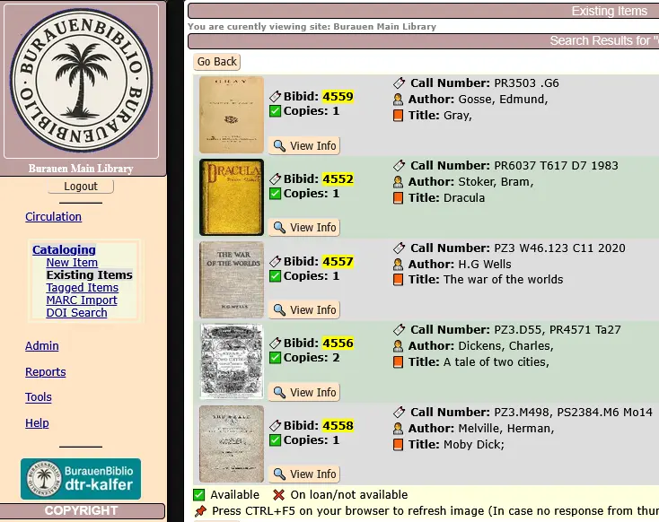

# BurauenBiblio 📚🌴

## Project Credit & Intent

BurauenBiblio is a derivative work of the original OpenBiblio system, tailored for modern PHP8.0 environments and localized school library needs in the Philippines.
Maintained as a community-driven, open-source initiative to revitalize and extend OpenBiblio's functionality designed to aid small libraries and schools.
It is named in honor of my hometown in Leyte, Burauen.

- Original Authors:  
  David Stevens, Joe Hagerty, Micah Stetson, Fred LaPlante  
  (See LICENSE and copyright.html for full attribution)

Maintainer: Ferdinand Tumulak
https://github.com/dtr-kalfer
Location: Burauen, Leyte, Philippines

This repository includes a small set of sample bibliographic records (books) and fictional member accounts as part of the included SQL data.
These are provided solely for the purpose of demonstrating and testing the functionality of the OpenBiblio system.

The book entries are either fictional or based on public domain sources, and any associated thumbnail images are used under public domain or fair use for educational/demo purposes.

The member records are entirely fictitious and do not represent real individuals.

This sample data is not intended for production use and should be modified or removed accordingly before deployment.

This project aims to preserve the spirit of OpenBiblio while modernizing its codebase for fast response (PHP8.0 supported), improved user-interface, new custom features and usability for current and future librarians and developers.

## 📦 Installation (see --> how_to_install.html)
